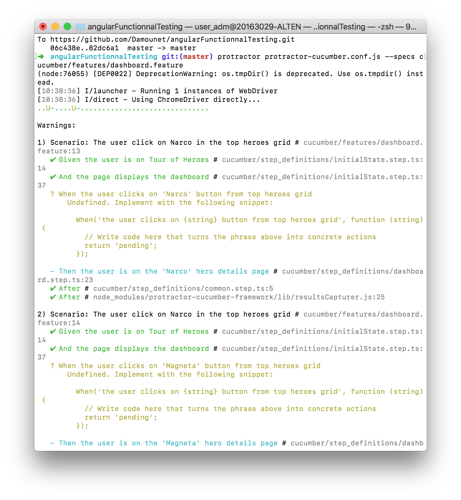

[How to write features files](../features) | [How to write pages files](../pages)

# How to write a step file

These files contain the feature steps implementation. There is one step file for one feature file.

This documentation has been written to allow the Quality Assurance (QA) to write the steps files and to give our best practices identified during our Proof Of Concept ([POC](https://en.wikipedia.org/wiki/Proof_of_concept)).

In our own environment, the files are written with Typescript because our functionnal tests have been set up for an Angular application. [Learn more about Typescript.](https://www.typescriptlang.org/)

They are named as :

> featureFileName.step.ts

## Steps

A step file contains the feature step implementation.

Feature file :

```Gherkin
Given I am on Tour of Heroes
```

Step implementation :

```Typescript
Given('I am on Tour of Heroes', function() {
    //Do code
});
```

## Import/Require

An import or a require signals to the compiler that the file needs some more things to work. To write a steps file at least these two things are needed :

- The pages used in the steps file, add the one needed specifically for the concerned steps file.

```Typescript
import { InitialPage } from '../pages/initialPage.po';
```

- Some libraries

Just copy/paste these import/require above all of your step files.

```Typescript
import { browser, Button, element, by } from 'protractor';
import { protractor } from 'protractor/built/ptor';

var { Given, When, Then, After } = require('cucumber');
const path = require('path');
const chai = require('chai');
const chaiAsPromised = require('chai-as-promised');
chai.use(chaiAsPromised);
const expect = chai.expect;
```

## Templates from cucumber

Cucumber can automatically generate some templates for the not implemented steps.

When the feature file is ready try to launch the functionnal test with :

> `protractor protractor-cucumber.conf.js`

Here is the result :



Cucumber signals with the yellow color, some unimplemented steps. It gives a basic templates for these steps.

The template returns the keyword `pending` which stops the scenario execution but it doesn't send an error.

## Testing tools

### Pages files

To help the QA with the functional test implementation, the developers have to create some "**pages**" files. These files contain some [helpers](https://en.wikipedia.org/wiki/Helper_class) to get some page elements like a button or an url. [For more informations about pages.](../pages/README.md)

### Browser main methods

#### Browser definition

browser is the protractor webdriver implementation : [Protractor browser documentation](https://www.protractortest.org/#/api?view=ProtractorBrowser)

#### get(url)

Navigate to the given destination.

```Typescript
browser.get('google.com');
```

#### getCurrentUrl()

Schedules a command to retrieve the URL of the current page.

```Typescript
return expect(browser.getCurrentUrl()).is.eventually.equal('google.com');
```

#### getTitle()

Schedules a command to retrieve the current page's title.

```Typescript
return expect(browser.getTitle()).is.eventually.equal('Google');
```

---

### User action methods

#### Definition

Methods to simulate user action during the tests.

#### click()

Used to click on button on the page.

```Typescript
googlePage.getSearchButton().click();
```

#### sendKeys('')

Used to write something in an input.

```Typescript
googlePage.getSearchInput().sendKeys('How to write a steps file');
```

#### Scroll methods

The measure unit is the pixel.

##### scroll(x,y)

Scrolls the window to a particular place in the document.

```Typescript
browser.executeScript('window.scroll(x,y)');
```

##### scrollBy(x,y)

Scrolls the document in the window by the given amount.

```Typescript
browser.executeScript('window.scrollBy(x,y)');
```

##### scrollIntoView()

The Element.scrollIntoView() method scrolls the element on which it's called into the visible area of the browser window.

```Typescript
browser.executeScript('page.getElement().scrollIntoView()');
```

##### Usage

scroll(x,y) is a way to scroll but it's not the way since our applications are X-Platform. The screen resolution won't be the same between a smartphone or a pc. Scroll(x,y) won't give the same result on these two devices. Its recommend to user scrollIntoView() in most cases and the two others functions for specific cases.

---

### Assertion

In computer software testing, a test assertion is a statement that asserts that a given premise is true, if it's not then the program would throw an error.

#### expect()

This is the main element to the [BDD style assertion from chai](http://www.chaijs.com/api/bdd/). It uses a chainable language to construct assertions.

```Typescript
return expect(
    dashboardPage.getSearchHeroResult().isDisplayed()).chainableLanguage
```

#### Chainable language

##### is

This is a linker. It is not mandatory. The code is prettier with it.

##### eventually

This is mandatory. It transform a promise into a promise result. [Read more about Chai as promised and Eventually](https://www.npmjs.com/package/chai-as-promised)

##### not

Negates all assertions that follow in the chain.

```Typescript
return expect(browser.getCurrentUrl()).is.eventually.not.equal(dashboardPage.getUrl());
```

##### equal(parameter)

Asserts that the target is strictly (===) equal to the given val.

```Typescript
return expect(browser.getCurrentUrl()).is.eventually.equal(dashboardPage.getUrl());
```

##### include()

When the target is a string, include() asserts that the given string val is a substring of the target. [Read more about it to learn about the different types.](http://www.chaijs.com/api/bdd/#method_include)

```Typescript
return expect(browser.getCurrentUrl()).is.eventually.include(initialPage.getUrl());
```

##### true

Asserts that the target is strictly (===) equal to true.

```Typescript
return expect(initialPage.getRootElement().isDisplayed()).is.eventually.true;
```

---

### Examples

Feature file :

```Gherkin
Given I am on a specific website
```

Step implementation :

```Typescript
Given('I am on a specific website',function(){
    browser.get(websiteUrl);
    return expect(browser.getCurrentUrl()).is.eventually.equal(websiteUrl);
});
```

Feature file :

```Gherkin
When I want to click on this button
```

Step implementation :

```Typescript
When('I want to click on this button',function(){
    page.getThisButton.click();
    return expect(browser.getCurrentUrl()).is.eventually.equal(expectedPage.getUrl());
})
```

Feature file :

```Gherkin
Then I am on another page
```

Step implementation :

```Typescript
Then('I am on another page',function(){
    return expect(expectedPage.getTitle()).is.eventually.equal('Cucumber is awesome');
})
```

## Our best practices

- A Given and a When step have to check their own behavior.

> ```Typescript
> When('I want to click on this button',function(){
> page.getThisButton.click();
> return expect(browser.getCurrentUrl()).is.eventually.equal(expectedPage.getUrl());
> })
> ```
>
> During the above step the user clicks on the button and the steps checks if the current url is the same as the url of the expected page.

- A step file has to be created for each feature.
